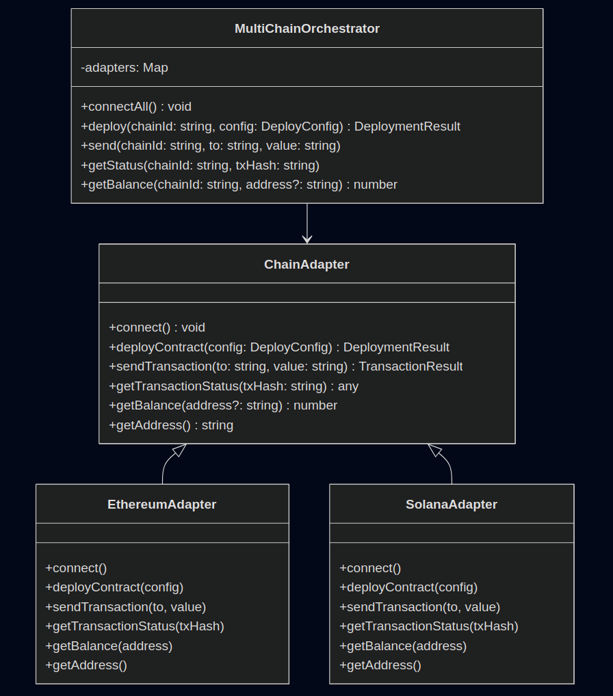

  <h1 align="center">Blockchain abstraction layer</h1>
  

     
    The blockchain abstraction layer defines a common interface for interacting with blockchains
     
    It uses the adapter pattern to support chain-specific implementations while keeping the integration modular.
  

 

## Adapter Pattern

The **Adapter Pattern** is used to define a standard interface across all supported blockchains:

### ChainAdapter Interface
The interface defines the core methods that are going to be needed regardless of the blockchain. All adapters conform to the same interface, so the system works consistently regardless of the chain.

Each blockchain has its own adapter implementation, For example:
- `EthereumAdapter` — EVM-compatible logic via `ethers.js`
- `SolanaAdapter` — Solana logic via `@solana/web3.js`

These adapters encapsulate chain-specific behavior behind the shared interface, ensuring that higher-level systems don’t depend on blockchain internals.

### Orchestrator

The **`MultiChainOrchestrator`** is an optional abstraction that:
- Manages a registry of chain adapters
- Delegates operations (deploy, send, status) to the correct adapter based on chain ID

 
 

    

